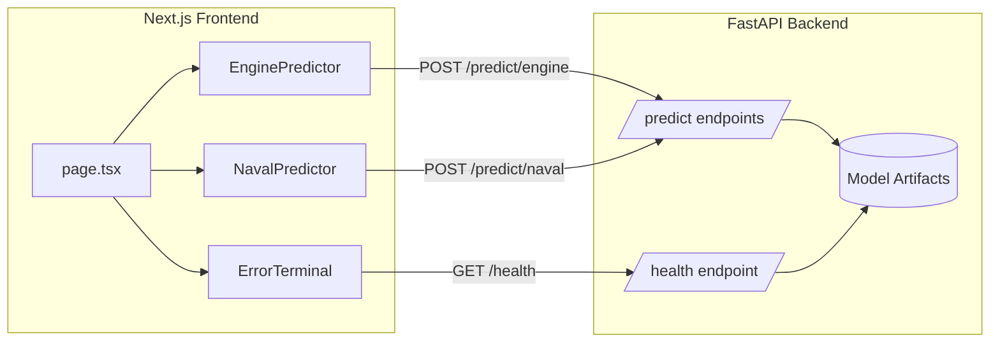
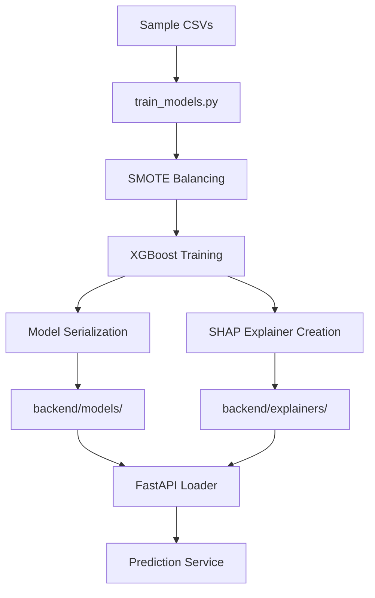
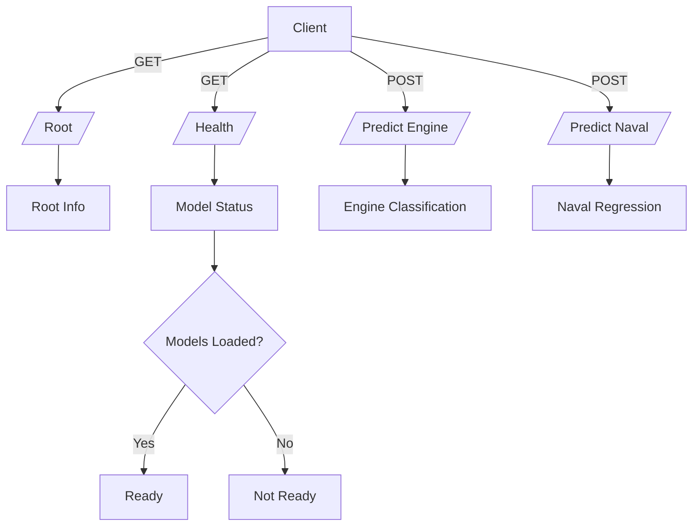

# Kurohana

So I grabbed your Colab notebook and wrapped it in a proper backend/frontend setup since I'm not a fan of running ML workflows in notebooks. The whole thing works end-to-end now—you've got a FastAPI service serving your XGBoost models and a Next.js UI for running predictions with SHAP explanations baked in (i still have no idea why you insist on using xgboost like lightgbm is a fucktillion times faster but aight).

## What I Built

Took your engine fault classification and naval condition regression models and turned them into a production-ready stack. Backend handles model loading, prediction endpoints, and health checks. Frontend gives you a clean interface to test predictions with preset payloads and see SHAP breakdowns in real time.

## Stack Overview

Backend is FastAPI with Uvicorn, using your XGBoost models and SHAP explainers. Frontend is Next.js 14 with Tailwind and the App Router. Everything talks over REST and the UI polls health status so you know when models are ready.

## Architecture



## Data Pipeline



## Tech Stack

**Backend**
- FastAPI for the API layer
- Uvicorn as ASGI server
- XGBoost for the models you trained
- Imbalanced-learn for SMOTE handling
- SHAP for feature explanations
- Pydantic for request validation

**Frontend**
- Next.js 14 with App Router
- React 19
- Tailwind CSS for styling
- Zod for schema validation
- lucide-react for icons

**Tooling**
- Python 3.11
- PNPM for frontend deps
- pytest for backend tests
- ESLint for frontend linting

## Getting It Running

### Backend Setup

```pwsh
cd backend
python -m venv venv
./venv/Scripts/Activate.ps1
pip install -r requirements.txt

# Train models from your sample data
python utils/train_models.py all

# Start the API
./venv/Scripts/python.exe main.py
```

API runs on `http://localhost:8000` by default.

### Frontend Setup

```pwsh
cd kuronaha-frontend
pnpm install
pnpm dev
```

Frontend runs on `http://localhost:3000`. If you changed the backend port, update `NEXT_PUBLIC_API_BASE_URL` in your environment.

## Project Structure

```
kurohana/
├── backend/
│   ├── main.py                 # FastAPI app entry
│   ├── models/                 # Serialized XGBoost models
│   ├── explainers/             # SHAP explainers
│   ├── sample_data/            # Your training CSVs
│   ├── utils/
│   │   └── train_models.py     # Model training script
│   └── tests/
│       └── test_main.py        # API tests
│
├── kuronaha-frontend/
│   ├── app/
│   │   ├── page.tsx            # Main page component
│   │   └── layout.tsx          # Root layout
│   ├── components/
│   │   ├── EnginePredictor.tsx # Engine fault classifier UI
│   │   ├── NavalPredictor.tsx  # Naval regression UI
│   │   └── ErrorTerminal.tsx   # Health log display
│   └── lib/
│       └── api.ts              # API client functions
│
└── guides/
    ├── backend.md              # Backend ops guide
    ├── frontend.md             # Frontend dev guide
    ├── data.md                 # Dataset documentation
    └── models.md               # Training guide
```

## How The Models Work

### Engine Classifier

Takes four sensor measurements and predicts fault category. Backend loads the XGBoost classifier and SHAP explainer on startup. Each prediction returns the predicted class, confidence scores, and SHAP feature contributions.

**Input Schema**
```json
{
  "sensor_measurement_1": float,
  "sensor_measurement_2": float,
  "sensor_measurement_3": float,
  "sensor_measurement_4": float
}
```

### Naval Regressor

Predicts compressor decay from lever position and ship speed. Same pattern as the classifier—XGBoost model with SHAP explainer providing feature importance per prediction.

**Input Schema**
```json
{
  "lever_position": float,
  "ship_speed": float
}
```

## API Endpoints



**GET /**
Root endpoint with API info.

**GET /health**
Returns model loading status per domain.

```json
{
  "engine": {
    "model_loaded": true,
    "explainer_loaded": true
  },
  "naval": {
    "model_loaded": true,
    "explainer_loaded": true
  }
}
```

**POST /predict/engine**
Engine fault classification with SHAP values.

**POST /predict/naval**
Naval condition regression with SHAP values.

## Frontend Features

**Health Bar**
Sticky header shows backend status and last refresh time. Auto-refreshes every 5 seconds so you know if models drop.

**Predictor Cards**
Side-by-side cards for engine and naval predictions. Each has preset buttons for quick testing and manual input fields.

**Terminal Widget**
Streams API responses and errors in a terminal-style log. Uses microtask queuing to avoid React state warnings during rapid updates.

**SHAP Visualization**
Results show feature importance inline with each prediction. Positive contributions highlighted in green, negative in red.

## Testing

### Backend Tests

```pwsh
cd backend
pytest
```

Tests cover root endpoint, health checks, and prediction paths including missing artifact scenarios.

### Frontend Linting

```pwsh
cd kuronaha-frontend
pnpm lint
```

Runs ESLint with TypeScript and Tailwind plugins.

## Training Your Own Models

If you want to retrain on new data, drop your CSVs into `backend/sample_data/` and run:

```pwsh
python utils/train_models.py all
```

Script handles SMOTE balancing for the classifier, trains XGBoost models, generates SHAP explainers, and serializes everything to the right directories. Backend picks up the new artifacts on next restart.

See `guides/models.md` for preprocessing requirements and artifact troubleshooting.

## Deployment Notes

Backend refuses predictions until both model and explainer exist per domain. Health endpoint exposes this status so you can wire up proper readiness checks.

For production, swap `python main.py` for a proper ASGI server config with workers and logging. Frontend needs `NEXT_PUBLIC_API_BASE_URL` set to your backend domain.

## What Could Be Added

- Docker Compose setup for one-command deployment
- CI pipeline for automated testing both stacks
- Component tests with Vitest and React Testing Library
- Model versioning and A/B testing support
- Metrics endpoint for monitoring prediction latency

## Reference Files

- `guides/backend.md`: FastAPI operations and testing details
- `guides/frontend.md`: Next.js structure and component docs
- `guides/data.md`: Dataset format and preprocessing notes
- `guides/models.md`: Training workflow and artifact management

## License

MIT

---

Let me know if anything needs adjustment or if you want me to add sections. Whole thing should work pretty well. goodluck with the marine stuff